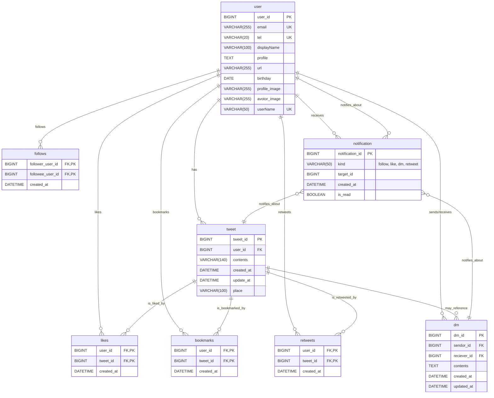

```mermaid
erDiagram
    user {
        BIGINT user_id PK
        VARCHAR(255) email UK
        VARCHAR(20) tel UK
        VARCHAR(100) displayName
        TEXT profile
        VARCHAR(255) url
        DATE birthday
        VARCHAR(255) profile_image
        VARCHAR(255) avotor_image
        VARCHAR(50) userName UK
    }

    tweet {
        BIGINT tweet_id PK
        BIGINT user_id FK
        VARCHAR(140) contents
        DATETIME created_at
        DATETIME update_at
        VARCHAR(100) place
    }

    follows {
        BIGINT follower_user_id FK,PK
        BIGINT followee_user_id FK,PK
        DATETIME created_at
    }

    likes {
        BIGINT user_id FK,PK
        BIGINT tweet_id FK,PK
        DATETIME created_at
    }

    notification {
        BIGINT notification_id PK
        VARCHAR(50) kind "follow, like, dm, retweet"
        BIGINT target_id
        DATETIME created_at
        BOOLEAN is_read
    }

    dm {
        BIGINT dm_id PK
        BIGINT sendor_id FK
        BIGINT reciever_id FK
        TEXT contents
        DATETIME created_at
        DATETIME updated_at
    }

    bookmarks {
        BIGINT user_id FK,PK
        BIGINT tweet_id FK,PK
        DATETIME created_at
    }

    retweets {
        BIGINT user_id FK,PK
        BIGINT tweet_id FK,PK
        DATETIME created_at
    }

    user ||--o{ tweet : "has"
    user ||--o{ follows : "follows"
    user ||--o{ likes : "likes"
    user ||--o{ notification : "receives"
    user ||--o{ dm : "sends/receives"
    user ||--o{ bookmarks : "bookmarks"
    user ||--o{ retweets : "retweets"

    tweet ||--o{ likes : "is_liked_by"
    tweet ||--o{ bookmarks : "is_bookmarked_by"
    tweet ||--o{ retweets : "is_retweeted_by"

    tweet ||--o{ dm : "may_reference"
    notification }o--|| tweet : "notifies_about"
    notification }o--|| user : "notifies_about"
    notification }o--|| dm : "notifies_about"
```
