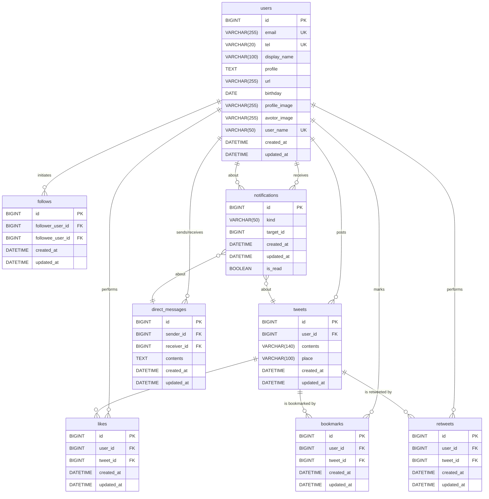

```mermaid
erDiagram
    users {
        BIGINT id PK
        VARCHAR(255) email UK
        VARCHAR(20) tel UK
        VARCHAR(100) display_name
        TEXT profile
        VARCHAR(255) url
        DATE birthday
        VARCHAR(255) profile_image
        VARCHAR(255) avotor_image
        VARCHAR(50) user_name UK
        DATETIME created_at
        DATETIME updated_at
    }

    tweets {
        BIGINT id PK
        BIGINT user_id FK
        VARCHAR(140) contents
        VARCHAR(100) place
        DATETIME created_at
        DATETIME updated_at
    }

    follows {
        BIGINT id PK
        BIGINT follower_user_id FK
        BIGINT followee_user_id FK
        DATETIME created_at
        DATETIME updated_at
    }

    likes {
        BIGINT id PK
        BIGINT user_id FK
        BIGINT tweet_id FK
        DATETIME created_at
        DATETIME updated_at
    }

    notifications {
        BIGINT id PK
        VARCHAR(50) kind
        BIGINT target_id
        DATETIME created_at
        DATETIME updated_at
        BOOLEAN is_read
    }

    direct_messages {
        BIGINT id PK
        BIGINT sender_id FK
        BIGINT receiver_id FK
        TEXT contents
        DATETIME created_at
        DATETIME updated_at
    }

    bookmarks {
        BIGINT id PK
        BIGINT user_id FK
        BIGINT tweet_id FK
        DATETIME created_at
        DATETIME updated_at
    }

    retweets {
        BIGINT id PK
        BIGINT user_id FK
        BIGINT tweet_id FK
        DATETIME created_at
        DATETIME updated_at
    }

    users ||--o{ tweets : "posts"
    users ||--o{ follows : "initiates"
    users ||--o{ likes : "performs"
    users ||--o{ notifications : "receives"
    users ||--o{ direct_messages : "sends/receives"
    users ||--o{ bookmarks : "marks"
    users ||--o{ retweets : "performs"

    tweets ||--o{ likes : "is liked by"
    tweets ||--o{ bookmarks : "is bookmarked by"
    tweets ||--o{ retweets : "is retweeted by"

    notifications }o--|| tweets : "about"
    notifications }o--|| users : "about"
    notifications }o--|| direct_messages : "about"
```
